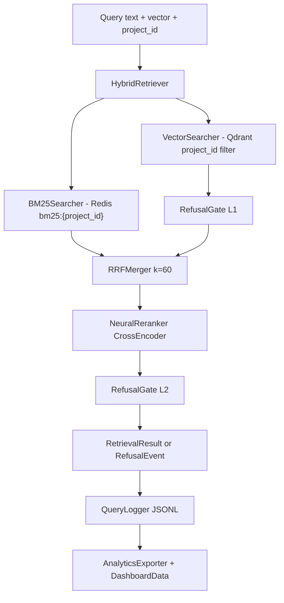

# Retrieval Architecture

## Component Diagram



## Data Flow

1. M3 rewrites the user message and embeds it.
2. Nikhil (RAG Lead) runs BM25 and dense search concurrently.
3. Gate 1 refuses low-similarity dense results.
4. RRF merges BM25 and dense hits.
5. CrossEncoder reranks candidates.
6. Gate 2 refuses low-confidence reranker results.
7. M3 receives `RetrievalResult` or `RefusalEvent`.
8. Query logging and dashboard analytics run asynchronously.

## API Contract

```python
await query_pipeline(
    query: str,
    vector: list[float],
    project_id: str,
    user_id: str = "default",
    conversation_id: str | None = None,
    standalone_query: str | None = None,
    enable_logging: bool = True,
) -> RetrievalResult | RefusalEvent
```

## Schemas

Core dataclasses live in `backend/shared/types.py`:

- `BoundingBox`
- `RetrievedChunk`
- `RetrievalResult`
- `RefusalEvent`

## Integration Points

- M3 calls `query_pipeline()` and stores debug with `store_debug()`.
- M4 consumes `RetrievalResult.chunks`.
- M5 reads `/api/retrieval/debug`, `/api/retrieval/analytics/*`, and `/api/retrieval/metrics/*`.

## Performance Characteristics

Target latency:

- p50 < 350ms
- p99 < 500ms normal load
- p99 < 1000ms at 50 concurrent sustained load

Recall target:

- recall@10 >= 0.95 after HNSW tuning
- ndcg@10 >= 0.75 after eval calibration
