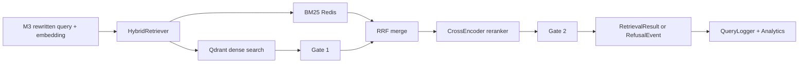

# Retrieval Runbook

## Architecture Overview

The retrieval service receives an embedded query from M3 and returns either a `RetrievalResult` with reranked chunks or a `RefusalEvent`.

Flow:



## Startup Procedure

1. Ensure `.env` is configured.
2. Start Qdrant and Redis.
3. Start the API service.
4. Verify health:

```powershell
curl http://localhost:8000/api/health
```

5. Confirm reranker model cache is populated under the Docker `model_cache` volume.

## Health Checks

- `qdrant`: collection exists and count is readable.
- `bm25`: Redis responds and at least one `bm25:*` key exists.
- `reranker`: CrossEncoder model is loaded in memory.
- `chunks`: approximate Qdrant point count.
- `last_calibration`: whether `.env` has a non-zero `GATE2_THRESHOLD`.

## Common Issues

### Qdrant Connection Refused

Check Docker service status and `QDRANT_HOST`. Confirm port `6333` is reachable.

### BM25 Index Missing

Check M2 ingestion status and Redis keys:

```powershell
redis-cli keys "bm25:*"
```

### Reranker Model Not Loading

Check disk space, network access on first boot, and `model_cache` volume mounts for Hugging Face and Torch.

### High Latency

Check p99 latency, API CPU, `RETRIEVAL_TOP_K`, `RERANKER_MODEL`, and Qdrant `ef_search`.

### False Positives Increasing

Run calibration and threshold effectiveness:

```powershell
python backend\eval\calibrate_gate2.py --project-id adani-q2-fy26
python backend\eval\threshold_effectiveness.py
```

## Monitoring

Watch:

- p99 latency > 500ms: degraded.
- p99 latency > 1000ms: critical.
- error rate > 5%: critical.
- refusal rate sudden spike: inspect Gate 1/Gate 2 thresholds.

## Scaling

- Add API workers when reranker CPU is saturated.
- Reduce `RETRIEVAL_TOP_K` or switch to `MiniLM-L-2-v2` under sustained load.
- Add Qdrant replicas when dense search latency rises.

## Rollback

- Revert `GATE2_THRESHOLD` to prior known-good value.
- Set `DYNAMIC_THRESHOLDS_ENABLED=false` to fall back to static thresholds.
- Revert `RERANKER_MODEL` to the previous model and restart API workers.
